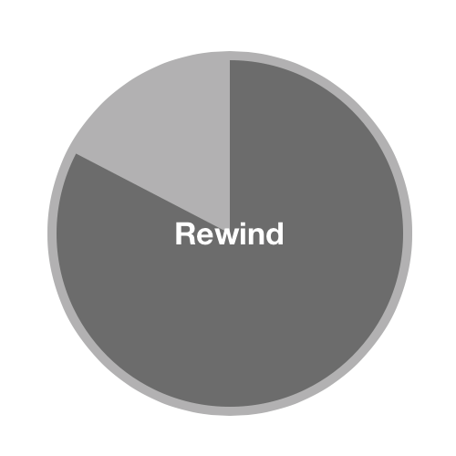

HKRewind
========

HKRewind features a [UIGestureRecognizer](http://developer.apple.com/library/ios/#documentation/uikit/reference/UIGestureRecognizer_Class/Reference/Reference.html) subclass and a HUD view that help you implement a rewind gesture à la [Paper by Fifty-Three](http://www.fiftythree.com/paper).

HKRewind uses Auto-layout, which makes it iOS6+ compatible only. It should be noted that HKRewind uses [HKCircularProgressView](https://github.com/Harmek/HKCircularProgressView) (version 1.1.0)

How to use it
-------------

1. Use [CocoaPods](http://www.cocoapods.org) by adding *pod 'HKRewind'* in your Podfile.
2. Manually:
  * Clone [HKCircularProgressView](https://github.com/Harmek/HKCircularProgressView) (version 1.1.0) and import its files.
  * Clone this repository
  * Copy HKRewindGestureRecognizer, HKRewindView, HKArcPoints, HKGeometryHelpers, HKRewindHUD files (.h, .m and .mm) into your project.
  
Import *HKRewindGestureRecognizer.h", add an instance of this recognizer to your view and use it as you would with any subclass of UIGestureRecognizer. If you want to use the HUD view import *HKRewindHUD.h*, create a HUD for your view with the _HUDForView:(UIView *)view_ method and show/hide it with *showHUDAnimated:(BOOL)animated* and *hideHUDAnimated:(BOOL)animated*.

For a simple example, pleaser refer to the *HKRewindViewController* class in this repository.

How to configure it
-------------------

### HKRewindGestureRecognizer

HKRewindGestureRecognizer emits 3 [UIGestureRecognizerStates](http://developer.apple.com/library/ios/documentation/uikit/reference/UIGestureRecognizer_Class/Reference/Reference.html#//apple_ref/c/tdef/UIGestureRecognizerState): UIGestureRecognizerStateBegan (this is when you should show the HUD), UIGestureRecognizerStateChanged (this is when you should use the rotationDelta property in order to update the HUD) and UIGestureRecognizerStateEnded (this is when you should hide the HUD).

You can customize the behavior of the gesture recognizer by editing those properties:

* numberOfTouchesRequired: the number of fingers that must be touching the view for this gesture to be recognized. The default value is 2.
* timeout: the number of seconds the user is allowed to be inactive before the recognizer is cancelled. Default is 1.
* maximumRadius: the approximate radius of the circle that the user is likely to draw. If a visual cue is shown (like a circle) when the user performs the gesture, it should be set to the visual cue's radius. Default is 200.
* maximumRotationDelta: the maximum absolute value that rotationDelta will be assigned, in radians. Default value is Pi/50.

In order to retrieve the information provided by the gesture recognizer, use those properties:

* rotationDelta: angle, in radians, described by the user since the previous move. This is a signed value, do not use the clockwise property to negate this value.
* clockwise: boolean value determining whether the user is performing a clockwise rotation or not.
* velocity: the velocity of the rotation gesture in radians per second.

### HKRewindHUD

You should not *init* HKRewindHUD like a normal view, but instead you should use the _+ (instancetype)HUDForView:(UIView *)view_ method. Show and hide the HUD with *showHUDAnimated:(BOOL)animated* and *hideHUDAnimated:(BOOL)animated*.

You can customize the behavior of the HUD by accessing and editing those properties:

* rewindView: the underlying HKRewindView that is displayed. Use the _- (void)addProgression:(CGFloat)rotationDelta_ method on this property to update the progression. You can also customize the appearance of the view, please refer to HKRewindView's documentation for more information.
* animationDuration: the fade-in/fade-out animation duration. Default is 0.25 seconds.
* animationDelay: the fade-in/fade-out animation delay. Default is 0 seconds.
